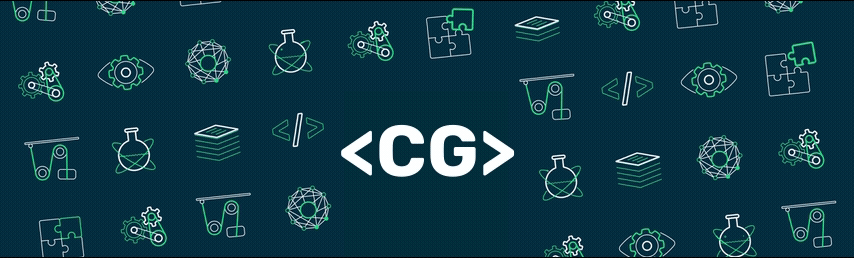

<h1 align="center">👋 Hi there, I'm Channakeshava Gowda SV (CG)</h1>
<h3 align="center">A passionate UI/UX Designer and Full-Stack developer from Bengaluru</h3>

-   🔭 I’m currently working on **Hero Motocorp**

-   🌱 I’m currently learning **Web3 and AI**

-   🤝 I’m looking for help with **Web3**

-   💻 Conatct ME or Visit My Portfolio [cg6.tech)

-   💬 Ask me about **React, Angular, Spring Boot - Apis, Node JS-Express**

-   📫 How to reach me **cg6.tech@gmail.com**

-   ⚡ Fun fact: Jack of all trades and **Master of Full-Stack Development**.

<h3 align="left">Connect with me:</h3>

<h3 align="left">Tools and Libraries:</h3>

<h3 align="left">UI Frameworks & Softwares:</h3>

  

<h3 align="left">Languages:</h3>

<h3 align="left">Developement Frameworks:</h3>

 

<h3 align="left">Databases & Dev Tools:</h3>

<h3 align="left">Cloud Development Tools:</h3>

&nbsp;

